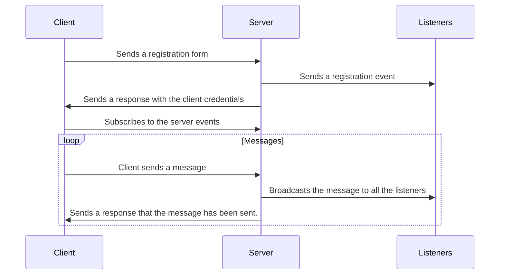

# server-sent-events-chat

A simple chat application using server-sent events.

This is mainly a proof of concept for learning how to user server-sent events. Inside the repository you'll find two main folders, those being:

- server
- web

Where the server is a NodeJS application build with `Express` and the web is a `React` application.

## How it works

Server sent events are an alternative to `WebSockets` and `polling`, they work by having a connection open between the client and the server, and the server can send data to the client whenever it wants.

The application has a sign-in flow to allow users to be identified in the server and in the client, the sign-in flow works as follows:



### Server

The server follows the observer pattern, where the server is the subject and the listeners are the observers. The server has a list of listeners that are subscribed to the server events, and when the server sends a message to the listeners, all the listeners will receive the message. This is done using the `Observable` class, for each request the server will dispatch an event to notify the listeners that the server state has changed. These events are:

- `UserSignedIn` - When a user signs in
- `UserSignedOut` - When a user signs out
- `UserMessage` - When a user sends a message

### Web

Following the server message patterns, the client listens for the server events and updates the UI accordingly. The `SSE` implementation in the front-end is done using the `EventSource` class ([references here](https://developer.mozilla.org/en-US/docs/Web/API/Server-sent_events/Using_server-sent_events)), this class is responsible handling the request connection and dispatching `message` events when the server sends a message. The implementation details for this are hidden in the `useRealtimeMessages` hook.

## Running the application

To run the application you'll need to have `NodeJS` and any package manager installed in your machine.

### Server

```bash
# Install the dependencies (I'm using pnpm)
cd server
pnpm i
```

After that, you can run:

```bash
pnpm dev
```

And it'll start the server in the port `3333`.

### Web

```bash
# Install the dependencies
cd web
pnpm i
```

And then run the following command:

```bash
pnpm dev
```

And it'll start the web application in the port `5173`

> You can access it here: http://localhost:5713.

## Technologies

- [NodeJS](https://nodejs.org/en/)
- [Typescript](https://www.typescriptlang.org/)
- [Express](https://expressjs.com/)
- [React](https://reactjs.org/)
- [Vite](https://vitejs.dev/)

## References

- [Server Sent Events](https://developer.mozilla.org/en-US/docs/Web/API/Server-sent_events)

## Author

|  |
| ------------------------------------------------------ |
| [Eder Lima](https://github.com/asynched)               |
